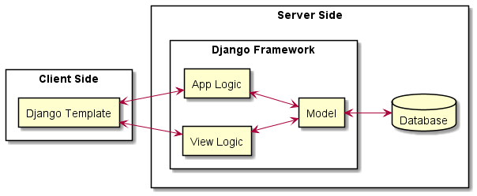
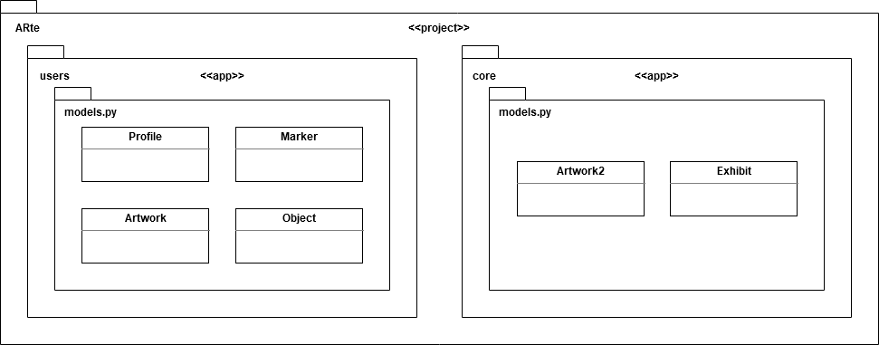
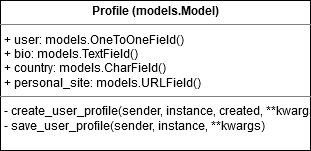
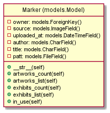
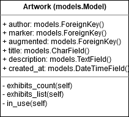
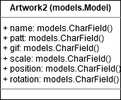
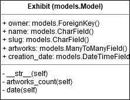

#  Revision  History
 
  |Version | description| Author(s) | date |
  |--------|------------|-----------|------|
  |1.0 |Intial version |vitor Gomide & Emanuel Holanda | 04/10/2020| 
  

# Software Architecture Document (SAD)
## introduction 
   this document provides a high overview and explains the archicture of jandig arte system . 
   
   This document provides a complete architectural overview of the Jandig ARte project. In it, you’ll find the goals and constraints of architecture, the use-case view, the logical view, among others.
   
### scope 
  This document is extremely important for understanding the project as a whole, since architecture is the basis of all software. It is not only suitable for people who want to contribute to the project, but also so that the current team can remember and even change previous architectural decisions.

### Definitions, Acronyms, and Abbreviations
- **SAD:** Software Architecture Document
- **App** : Application
- **MTV:** Model-Template-View
- **PWA:** Progressive Web App

### references

 - [Jandig ARte's Wiki](https://github.com/memeLab/Jandig/wiki/Jandig-ARte-architecture)
 - [CSUN's Software Architecture Document Template](https://www.google.com/url?sa=t&rct=j&q=&esrc=s&source=web&cd=&cad=rja&uact=8&ved=2ahUKEwjX4638opzsAhXlHrkGHfRtDwkQFjALegQIARAC&url=https%3A%2F%2Fprojects.cecs.pdx.edu%2Fattachments%2Fdownload%2F3180%2FSoftware_Architecture_Document_SF.docx&usg=AOvVaw0aIZsfpWJeIJ52HMgh7nXx)
 - [Documento de Arquitetura de Software - Facom/UFU](https://www.google.com/url?sa=t&rct=j&q=&esrc=s&source=web&cd=&ved=2ahUKEwi9m7T2rpzsAhVuF7kGHVbrBYwQFjACegQIARAC&url=http%3A%2F%2Fwww.facom.ufu.br%2F~flavio%2Fpds1%2Ffiles%2F2016-01%2Frup_sad-template-documento-arquitetura.dot&usg=AOvVaw3qyZZysozErnD64wCX-vOy)
 - [Documento de Arquitetura de Software RDI-AEE](https://www.google.com/url?sa=t&rct=j&q=&esrc=s&source=web&cd=&cad=rja&uact=8&ved=2ahUKEwiE78LEr5zsAhV7GLkGHSWyAVMQFjAAegQIBRAC&url=http%3A%2F%2Frepositorio.aee.edu.br%2Fbitstream%2Faee%2F1106%2F3%2FTCC2_2018_2_GabrielLeiteDias_MatheusLimadeAlbuquerque_Apendice2.pdf&usg=AOvVaw2wXEOkYpBHmN32ChHHDgOh)

### Overview
  ...  

## Architectural Representation

Project's main programming language is Python, through Django framework. Django uses an exclusive architecture called **MTV (Model-Template-View)**, in which **Model** represents the data layer, **Template** represents user's interface and **View** acts as an intermediary layer between them:

Jandig ARte is a **Progressive Web App (PWA)**, which means it is an web app that has a similar use to a native mobile app. It uses **PostgreSQL** as database.

## Use-Case View
### Account Access and Management

The diagram below shows how account access and management is done, with users and system as actors. Please note that Visitor is an user that hasn't log in the app.

### Exhibition Creation

The following diagram points out all of the steps for creating a new exhibition in Jandig ARte, from the point of view of the Artist and of any other user of the app.

### Other Features

Below are shown some other interesting features from Jandig ARte:

## Logical View

### Overview

 Since the software is django-based , it contains projects, apps and layers . in janding Arte cases , we have two main apps: core and users .
 
     
 
 
### Architecturally Significant Design Packages

#### "Profile" Class Diagram 

#### "Marker" Class Diagram 

#### "Artwork" Class Diagram 

#### "Object" Class Diagram 

#### "Artwork2" Class Diagram 

#### "Exhibit" Class Diagram 

