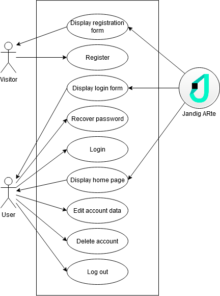
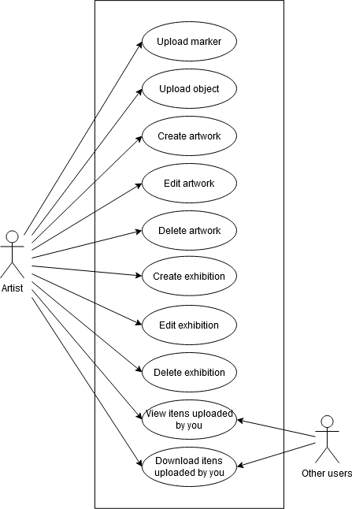
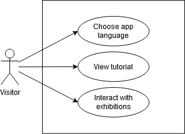

# Software Architecture Document (SAD)
## Use-Case View
### Account Access and Management

The diagram below shows how account access and management is done, with users and system as actors. Please note that Visitor is an user that hasn't log in the app.

### Exhibition Creation

The following diagram points out all of the steps for creating a new exhibition in Jandig ARte, from the point of view of the Artist and of any other user of the app.

### Other Features

Below are shown some other interesting features from Jandig ARte:

