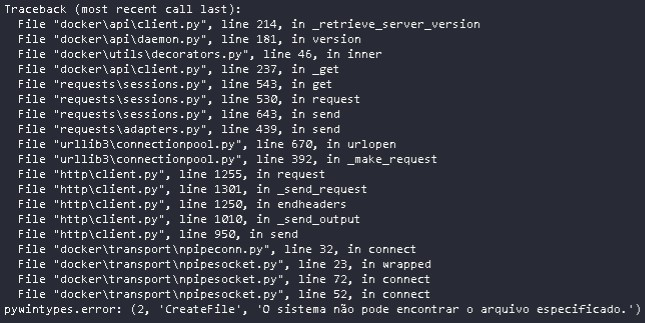
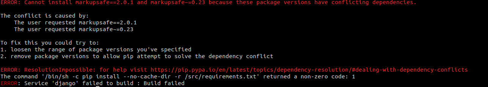
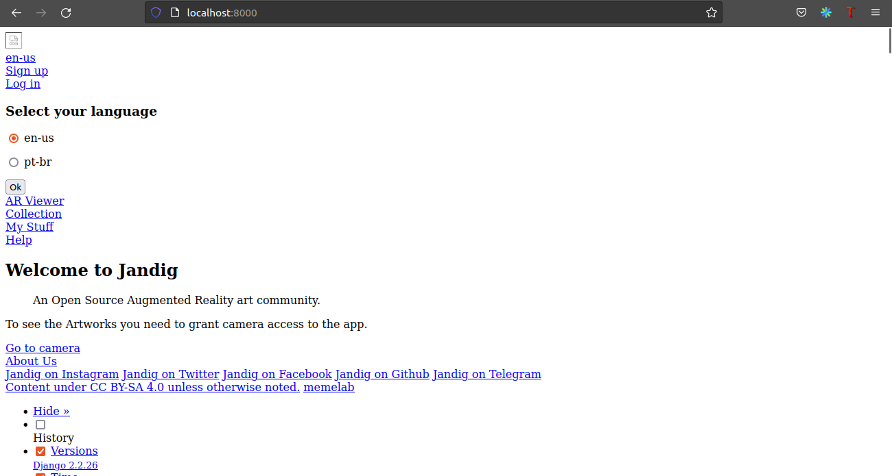
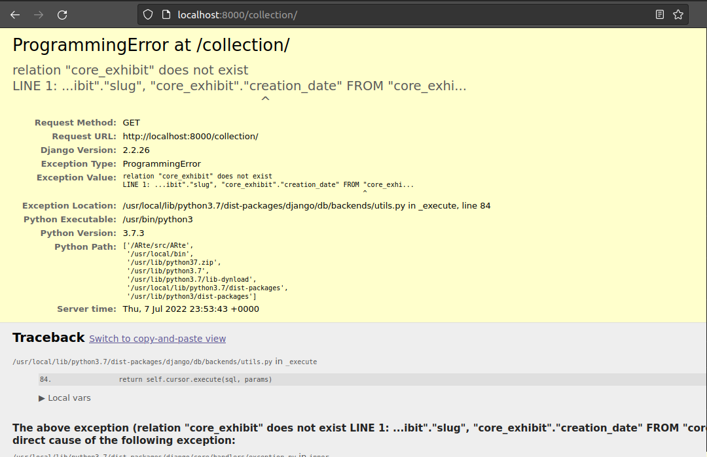
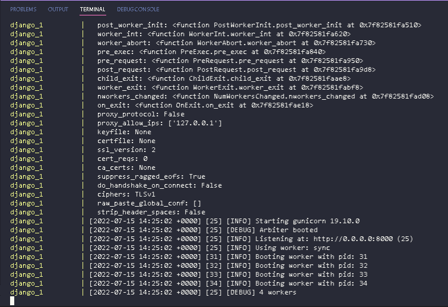

## Revision History
 
|Version | description| Author(s) | date |
|--------|------------|-----------|------|
|1.0|Initial version|João Victor Valadão|15/07/2022| 
|1.1|TODO|Marcelo Araújo dos Santos|18/07/2022| 


# Installation Guide

## Introduction 

This document provides an assistance guide with the details (step by step) of the installation of the Jandig and how to fix the most common bugs that may appear when beginners are trying to set up the environment, and start contributing to the Jandig project. So, as mentioned earlier, the purpose of this document is to help new contributors interact with the code, especially new developers that are interested in the application. Make sure to check the prerequisites to run Jandig ARte, because they are tools that you will need in your development workspace that you can access in the [description](http://memelab.com.br/jandig/README.md/) of the repository.

## Step 1 - Cloning the Repository

The first step after downloading the prerequisites is clone the repository, so we are going to need the following code:
```
git clone https://github.com/memeLab/Jandig
cd Jandig
```
If you are having any problems with the git commands consider checking the Github documentation for problems with the [cloning](https://docs.github.com/pt/repositories/creating-and-managing-repositories/troubleshooting-cloning-errors) or your user [authentication](https://docs.github.com/pt/account-and-profile/setting-up-and-managing-your-personal-account-on-github/managing-email-preferences/setting-your-commit-email-address)

## Step 2 - Running the Docker

Jandig uses docker and docker-compose to ensure a consistent development environment and to make the deploy process as painless as possible, so we are going to initialize the docker and then run the docker-compose.yml
```
docker-compose -f docker/docker-compose.yml up
```

### ERROR - Env file not found

If you receive an ERROR message saying it couldn't find env file, you probably didn't create the .env file yet. So navigate to **Jandig\src\\.envs\\** and create a file named **.env** and copy the content of **.example** and paste it in this file. Then run the above code again.

### ERROR - System could't find CreateFile
If you are receiving the following ERROR, that means your Docker has problems to initiate. Try to initialize the Docker Desktop manually with admin privileges, you can check the Docker Desktop running in your toolbar. If your docker isn't open yet consult the [DockerDesktop](https://docs.microsoft.com/pt-br/windows/wsl/tutorials/wsl-containers) documentation.



### ERROR - Duplicated dependency
If you are receiving the following ERROR or a similar one, that means that there are duplicated depencies. Sometimes when new Pull Requests are merged in the development branch, some dependencies can be updated or removed, and that results in duplicate dependencies or missing ones. This may not appear to other Jandig developers, since they already set their environments. 



In order to solve this problem we are going to check for duplicated or missing dependecies in the requirements.txt file. So, navigate so **Jandig\src** and open the mentioned file and we are going to look for the dependency that is presented in the error log in your terminal, in this case it's the "markupsafe" that appear in two differents versions and we are going to delete the outdated one. If you are receiving this error, please consider opening an issue in our [repository](https://github.com/memeLab/Jandig) or notify one of the maintainers.

### ERROR - Minio
If you encounter a screen as the image below, or some error message related to Minio, it's very likely that the `USE_MINIO` in **.env** file is set to True. To correct this, set it to False (`USE_MINIO=False`).



### ERROR - Migration

To solve the backend issue with migrations (image below)



do the following steps, as @GustavoAPS commented [here](https://github.com/memeLab/Jandig/issues/436#issuecomment-1034420328):
1. Run the container.
1. Open a new terminal and list the containers with "docker ps"
1. Enter the project container with "docker exec -it docker_django_1 bash"
1. Inside the container make the migrations with: `python3 src/ARte/manage.py migrate`
1. After the migrations, the problem should be solved.

## Step 3 - Jandig ARte in the localhost
After these steps you should have Jandig ARte running in your localhost, by default the project uses the **localhost:8000**. To access it you can copy the instruction above and paste in your browser or click [here](http://localhost:8000/)



The expected web page is shown below


Need more help? consult the issue "Problem to run Jandig ARte #436" [here](https://github.com/memeLab/Jandig/issues/436).
