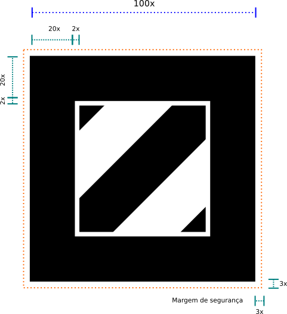

Hints to produce Tags
==============================

This document contains tecnical, aesthetics and good practices guidelines to the production of Tags of augmented reality Jandig.

Borders
------

The borders are grafic elements that trigger the recognition of the object associated with each tag. For this reason, one should not cover them and them must always be 
seen completely by the camera. Put the finger over the border or approach the camera too close to the tag will derail the recognition, for example. This feature should 
be always taken into account in the production and application of the tags.

We use by default 20% of width from the border in the Jandig tags, that is in a tag with 10 centimeters of width, we will have a border of 2 centimeters of width.

The central image of the Tag should not touch the borders. The minimum distance of the imagen to the internal margin of the border should be 2% of the total width of 
the Tag.

Although little texts (exhibition name, app url)  can be applied over the border without prejudice in the recognition, is recomended the height of the text never 
overtake the total porcentage of the border.

Symmetry
--------

Considering that the visualization of the object depends on the position of the Tag in relation of the camera, we avoid using images with symmetry vertical as well as 
horizantal. This rule aim avoid that the recognition system get confused about which orientation it must show the image.

Colors and gradient
------------------

To ensure endless possibilities of application of the Tags, we dont use colors or gradients in the central images. The only color used is 100% black, without 
utilization of tones.

This is not a limitation of the system. It is possible to use any image as a Tag, following other recomedations of this document.

Printing and about that
-----------------

Reflexes, including over the borders, can impede that your Tags be recognized as a Tag. So that thay are recognized more easily by the system, they should utilize 
opaque paints and materials in them production. 

It's important that the external and internal margins of the border be always well delimited. In case of stickers or background application more dark, guarantee a 
white margin around the black border. This reservation of space must be at least 3% of the total marker width.

Illumination
----------

The quality and color of ambient lighting can influence the Tag reading. For a good visualization, prefer a well distributed illumination, that does not generate 
reflections and avoid using amber colored lighting.

Stickers
--------

Although Tags can be recognized even in very small formats, we usually produce Jandig Tags stickers with 5 x 5 centimeters. This dimension associates good perfomance 
with good readability of all elements, including the text.
