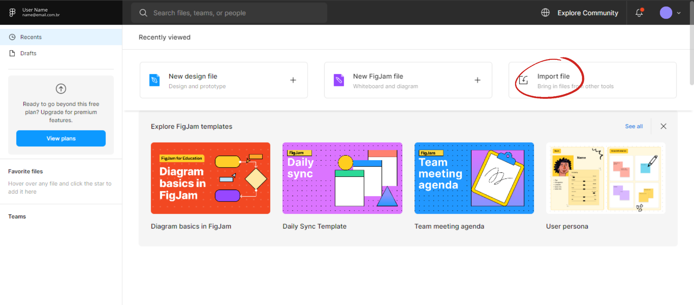
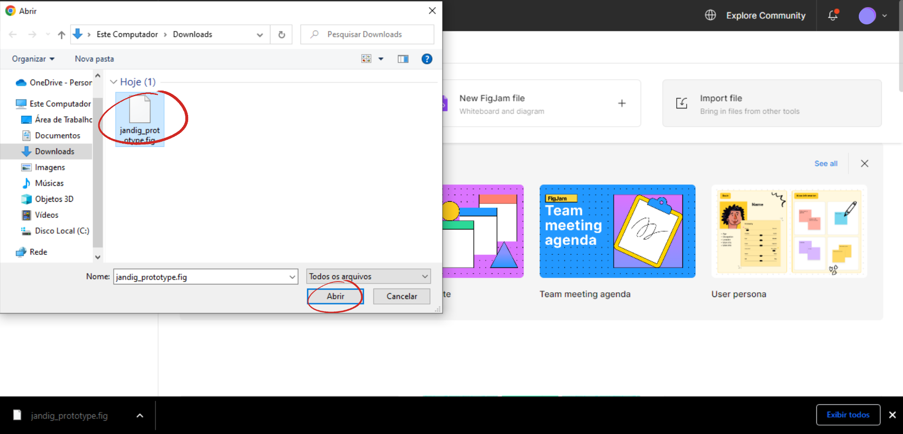
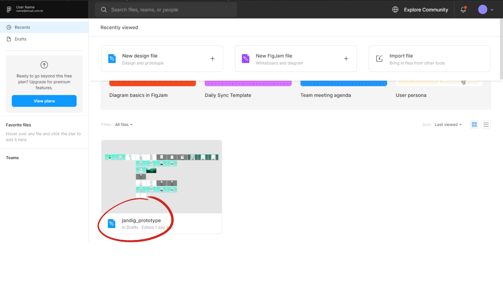

# Prototype
The Jandig platform prototype is a graphical representation of the platform developed using Figma [Figma](https://www.figma.com/downloads/) tool, it has the purpose of improving Jandig ARte platform's interface and user experience aspects. Thus, the High Fidelity Prototype is a representation of the platforms containing general usability improvements, used to arise activities to implement the suggested modifications.

## Accessing the Prototype
The prototype must be accessed using Figma platform, follow the steps below to access the prototype:

1 - Login or Register on [Figma](https://www.figma.com/login) platform;

2 - Download the [prototype file](https://github.com/memeLab/Jandig/blob/develop/docs/jandig_prototype.fig) to your computer;

3 - Select the "import file" option on figma's main screen and select the previously downloaded file;

5 - Access the prototype by clicking on the project.

## Contribuindo para o Prototipo

1 - Access the prototype using Figma platform as written in the tutorial described in the previous section;

2 - Open an Issue describing changes to be made to the prototype or select an existing issue and contribute to the issue. In order to do this follow the [contribution guide](https://github.com/memeLab/ARte/blob/master/.github/CONTRIBUTING.md);

3 - After making changes to the prototype following the guidelines of the chosen or created issue, upload the file following the steps below:

- 1 - Download the new version of the prototype onto your computer using your [Figma](https://www.figma.com/login);

    

    

    

- 2 - Upload the file "jadig_prototype.fig" replacing the existing file with the updated version.

