Como publicar conteúdo em realidade aumentada no Jandig
=======================================================

Bem-vindo ao Jandig ARte!

Para os recém-chegados artistas e utilizadores, gostaríamos de expressar os nossos agradecimentos por terem escolhido esta plataforma como uma ferramenta para expor suas Obras Jandig.

Neste manual iremos guiá-lo, passo a passo, sobre como criar as suas próprias peças de arte baseadas na tecnologia de Realidade Aumentada. Explicaremos também como o sistema funciona de uma forma significativa, com alguns conceitos centrais, para que conheça todos os passos a dar e como eles influenciam a sua arte. Conceitos tais como Marcadores, Objetos, como eles se co-relacionam para criar uma Obra Jandig e uma Exposição.

Vamos direto ao assunto, pois esta é uma leitura rápida e essencial para aqueles que querem utilizar o Jandig como o seu principal criador de arte AR.

Tutorial de Iniciação Rápida
~~~~~~~~~~~~~~~~~~~~~~~~~~~~

Acesse “https://jandig.app/generator”. Faça upload da imagem a ser utilizada no Marcador sem a borda preta (ela será adicionada pelo aplicativo). Baixe o Marcador (Download .PATT Marker) e a imagem (Download image Marker) e guarde os arquivos em um local seguro. Se quiser, baixe PDFs com os Marcadores para impressão. Importante: colocar o Patern Ratio como 0.60.

Acesse “http://jandig.art” e crie uma conta.

Clique em “Enviar Marcador” e suba a imagem (com extensão “.PNG”) e Marcador (“.PATT”) criadas na etapa anterior. Esta imagem é a que a câmera do Jandig reconhecerá.

Clique em “Enviar Objeto” e faça upload do GIF ou vídeo (nos formatos WEBM ou MP4) com a sua animação. Esta imagem o Jandig exibirá sobre a da câmera.

Clique em “Criar Obra Jandig”, escolha o Marcador e Objeto correspondente que você acabou de subir. Uma Obra Jandig é o conjunto do Marcador e Objeto, vinculando para ser apresentado em realidade aumentada.

Clique em “Criar Exposição”. Escolha uma ou várias Obras. Dê um título para o conjunto e defina sua URL. Ela será usada para acessar o conjunto de Obras criado por você. Por exemplo, se você inserir “expoteste” a URL definitiva para acessar sua(s) criações será “https://jandig.app/expoteste”.

Acesse a URL definitiva que você acabou de criar, aponte a câmera para o Marcador e veja a mágica acontecer!

Tutorial - Aprenda o básico
~~~~~~~~~~~~~~~~~~~~~~~~~~~

Antes de mais, é necessário criar uma conta, para que os artistas possam distribuir as suas peças. Não é necessário para aqueles que apenas desejam apreciar uma Obra Jandig, mas para aqueles que querem trabalhar ativamente com a plataforma, é essencial.

Para tal, por favor consulte os passos abaixo.

1) Acesso o website do Jandig clicando no `URL`_ apropriado, e clique no botão "Sign up".

.. _URL: jandig.app

.. _imagem: https://jandig.app/users/signup/

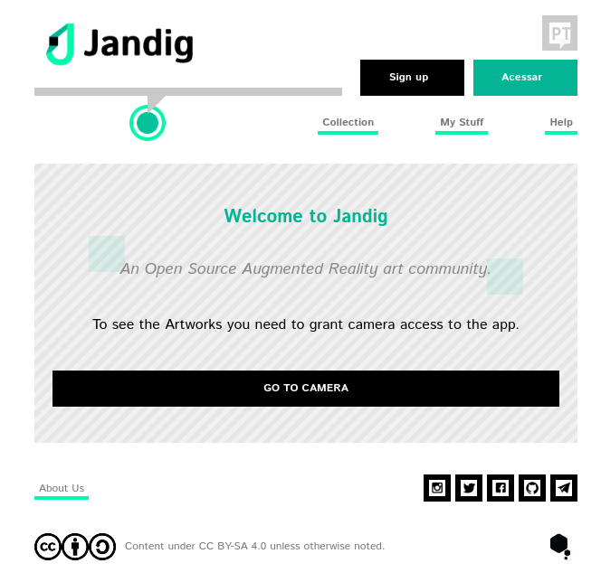
   
   Página principal do Jandig

2) Preencha os espaços com as suas informações, como mostra a `imagem`_, e submeta-a!

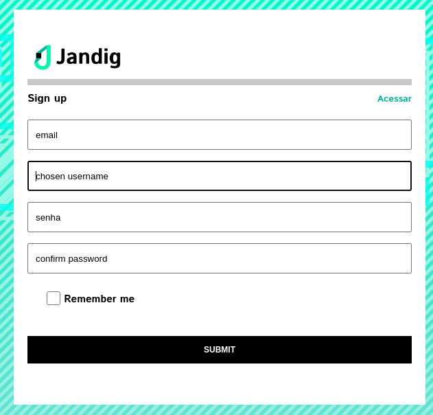
   
   Página de cadastro

3) Parabéns! Você criou com sucesso a sua conta Jandig ARte e pode agora contribuir ativamente para a comunidade artística com as suas peças baseadas em AR!

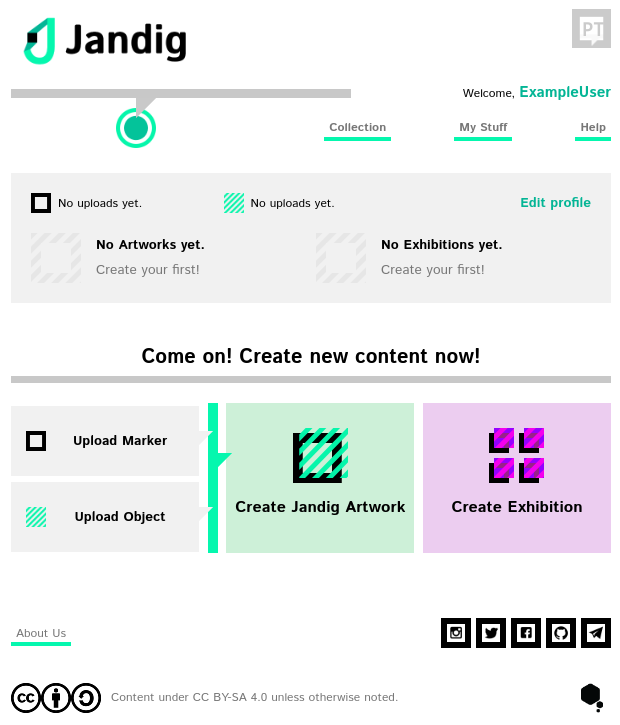

   Página pós-login

O passo seguinte seria produzir (e publicar) a sua primeira Obra Jandig. Para que possamos fazer tal tarefa, existem alguns conceitos a serem passados antes de poder começar.

Vamos dar uma olhada neles.

Marcadores
~~~~~~~~~~

Os Marcadores são a própria base de seu futuro trabalho artístico. Eles são essencialmente uma imagem feita por você, ou não, que é processada para que possa ser lida com sucesso pelo Jandig e apresentar sua Obra Jandig. 

Caracteristicamente, eles têm uma borda preta que é inserida ao redor do desenho, e esta borda serve para o Jandig reconhecer os Marcadores. 

Para criar um Marcador, tudo o que você precisa ter com você é sua imagem. Pode ser qualquer coisa, uma pintura ou uma imagem aleatória que você salvou do Google. Jandig fará todo o trabalho de processamento e geração de seu Marcador.

Para isso, vá até esta `página`_, e envie sua imagem para a geração de Marcadores. Dê uma olhada na imagem abaixo para ver como ela se parece, e onde carregar sua imagem.

.. _página: https://jandig.app/generator/

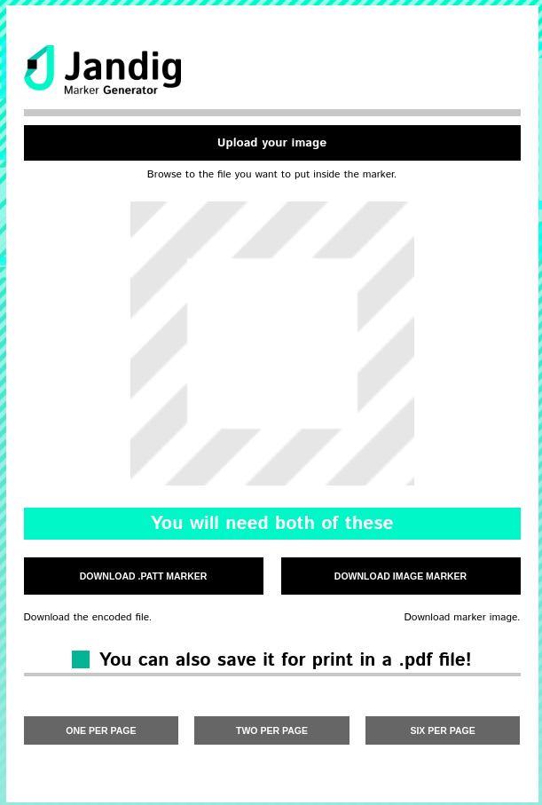

   Página de geração de Marcador

Ok, agora que você fez o upload de sua imagem, vá em frente e baixe os dois arquivos que lhe serão fornecidos pelo Jandig, o arquivo .patt Marker e o arquivo image Marker. Por uma questão de brevidade e simplicidade deste manual, o arquivo padrão (.patt) é o arquivo criado e usado pela maioria dos toolkits AR como o padrão que a tecnologia AR irá reconhecer.

Armazene estes dois arquivos em um local seguro, por segurança.

Agora tudo o que você precisa fazer é subir o arquivo! Volte à página principal do aplicativo e selecione o botão que diz "Upload Marker". Você será recebido por esta tela.

.. _main: https://jandig.app

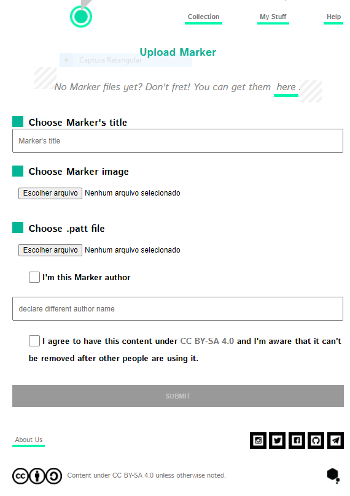
   
   Página de upload de Marcador   

É aqui que você enviará seu Marcador, então vá em frente e preencha os espaços com informações como título e nome do autor, caso você não seja o criador do Marcador, além  escolher de seu dispositivo a imagem do Marcador apropriada (aquele arquivo .png de antes) e o padrão do Marcador (aquele arquivo .patt de antes). Não se esqueça de ler todas as informações que a página contém.

Voilá! Você criou com sucesso e adicionou à sua coleção um Marcador de AR. Para o próximo passo, estaremos criando um Objeto!

Objetos
~~~~~~~

Quando você carregar um Marcador, o aplicativo o redirecionará para a página principal novamente. De lá, procure o botão que diz "Upload Object", que está logo abaixo do botão "Upload Marker". Vá em frente e clique nele, e o aplicativo o levará a esta `página`_.

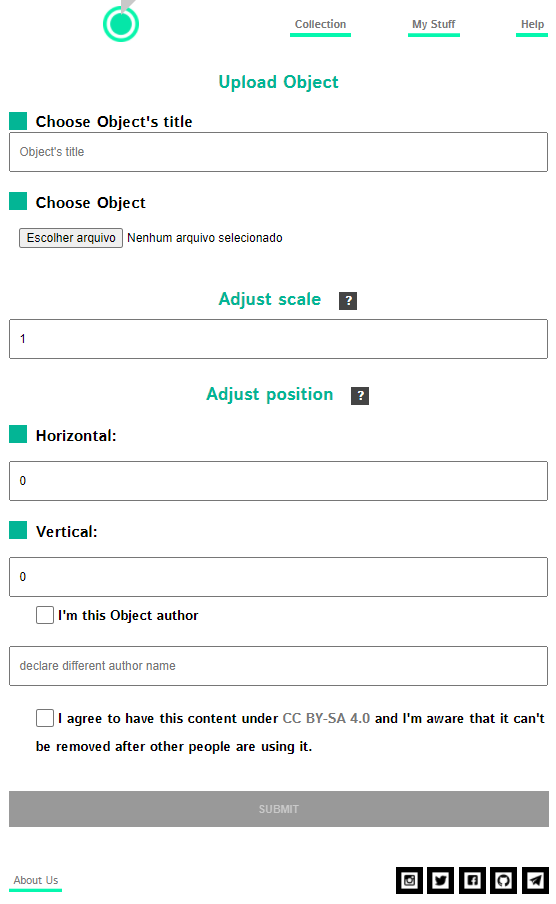
   
   Página de carregamento de Objetos
 
Nesta página, você enviará seu Objeto. Em termos  do Jandig, o Objeto é a animação que aparecerá em sua tela quando você ler o Marcador através da câmera do seu dispositivo. É a verdadeira magia da AR e aquela para a qual todo o trabalho anterior servirá. Portanto, vamos dar uma olhada na página e aprender como carregar um Objeto.

Embora este formulário de envio seja maior, o processo é muito mais simples. Antes de preenchê-lo, selecione e localize o arquivo que você deseja carregar. Os formatos suportados atualmente no Jandig são .gif, .webm (inclusive com transparência) e .mp4. 

Não há restrições quanto ao tamanho, tema, looping e outras especificações, mas recomendamos que você escolha um conteúdo que tenha um loop perfeito e seja relacionado à temática do Marcador. Além disso, não se restrinja a usar um arquivo que você tenha encontrado na internet ou em mídias sociais. Vá em frente e use todas as suas habilidades artísticas para criar o seu próprio! 

Agora é o momento de ter em mente que a escala e a posição do Objeto afetará o trabalho artístico. Há dois campos onde você pode preencher com números relacionados a esses dois parâmetros:

1) O parâmetro de escala, que é definido por padrão como 1. Se você quiser que sua imagem seja maior, digamos duas vezes o tamanho, basta mudar este número para 2. Se você quiser que seja três vezes o tamanho original, defina-o para 3, e assim por diante para outros tamanhos. Isto também se aplica para tamanhos menores e decimais, tais como 0,5 será metade do tamanho original do Objeto.
2) O parâmetro de posição, que deve ser ajustado em relação ao tamanho do Objeto na tela. Este é ainda dividido em outros dois parâmetros diferentes, horizontal e vertical. Estes dois parâmetros podem ser melhor compreendidos levando em consideração um gráfico. Seus valores padrão serão definidos como 0, o que marca o centro do gráfico, onde as linhas horizontais e verticais se interceptam. Vamos dar uma olhada em como manipulá-los:
   a) Horizontal: Se o valor for positivo e for 2, por exemplo, o centro do Objeto será colocado em uma distância 2 vezes maior do que o tamanho do seu lado Marcador à direita. Se este valor for negativo, digamos -2, será colocado à mesma distância 2 vezes o tamanho do seu lado Marcador para a esquerda.
   b) Vertical: Se o valor for positivo e for 2, por exemplo, o centro do objeto será colocado a uma distância 2 vezes maior do que o tamanho do seu lado Marcador, acima dele. Se este valor for negativo, digamos -2, será colocado à mesma distância 2 vezes o tamanho do seu lado Marcador, abaixo dele.
   
Depois de ter carregado com sucesso sua imagem e definido seus valores, não se esqueça de dar-lhe um título e dizer se você é seu autor ou não. 

Voilá! Você criou com sucesso seu Objeto e agora pode criar sua Obra Jandig! Lembre-se de que estes dois, Marcador e Objeto, ainda não estão ligados um ao outro. Isto acontecerá na próxima etapa.

Obras Jandig
~~~~~~~~~~~~~

Ok, então agora que já passamos por tudo o que precisávamos para criar uma Obra Jandig, vamos ao processo de criá-la de fato. Uma Obra Jandig é definida pela junção de duas coisas que trabalharão juntas para criar a interação que queremos alcançar.

Você adivinhou bem, precisaremos fazer uso do Marcador e Objeto criados anteriormente. Nesta seção selecionaremos um Marcador e um Objeto para que a magia possa ser feita e uma Arte AR possa ser vista através da câmera de seu dispositivo. Volte à página principal do Jandig mais uma vez e procure por este botão:

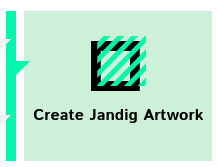

   Botão Create Artwork

Clique nele e você será redirecionado para uma página que se parece com esta:

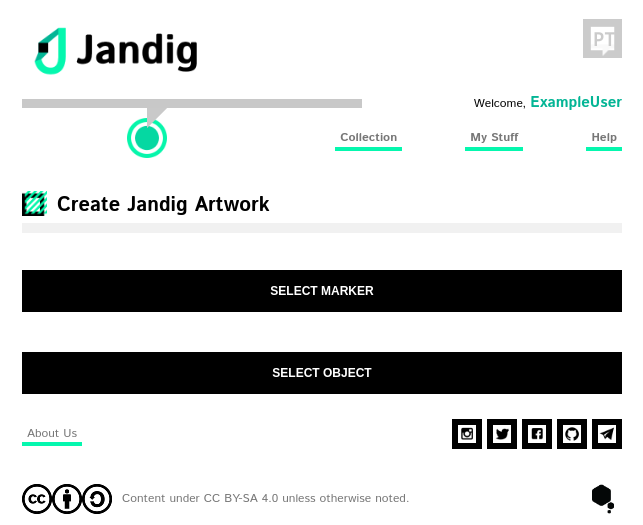

   Página de seleção de Marcador e Objeto

O processo é simples e direto e praticamente o mesmo para ambos os itens. Você será saudado por um pop-up com muitos Marcadores e Objetos no caso deles, ou nenhum. No caso deste manual ExampleUser, todos os Marcadores e Objetos do caso de teste apareceram. 

Basta selecionar um Marcador, aceitar os termos e pressionar ao lado para selecionar um Objeto. Aqui está um exemplo de Marcador e Objeto selecionados:

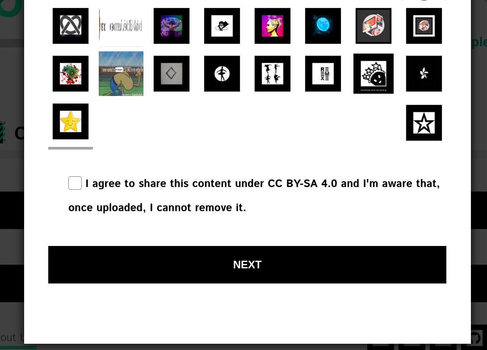

   Página de seleção de Marcador 

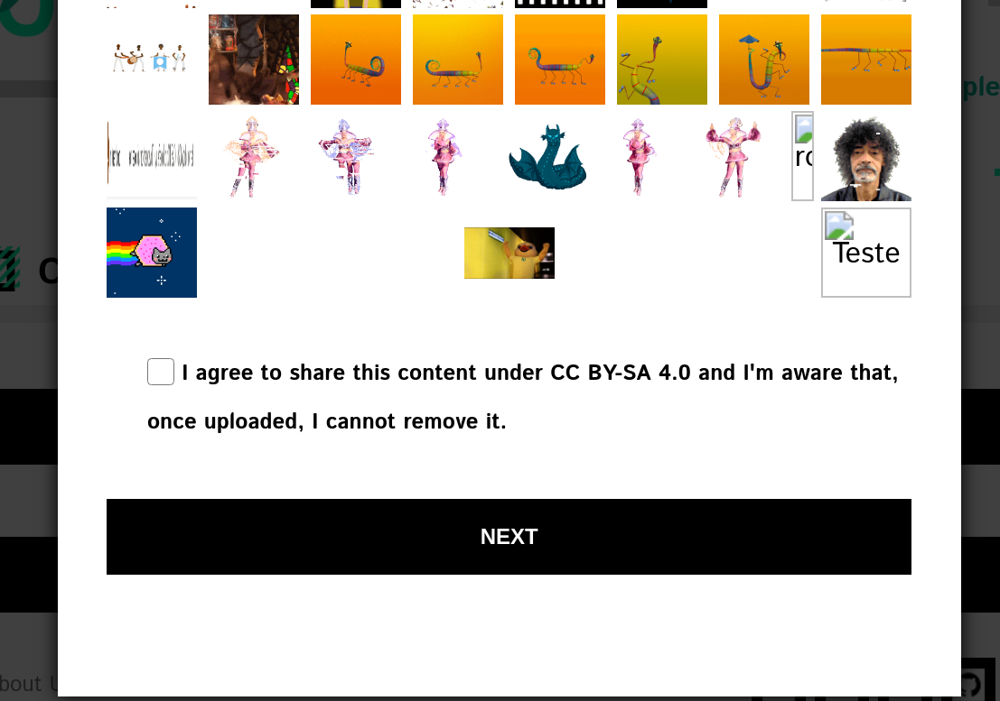

   Página de seleção de objeto 

Dê um título e uma descrição e pronto!

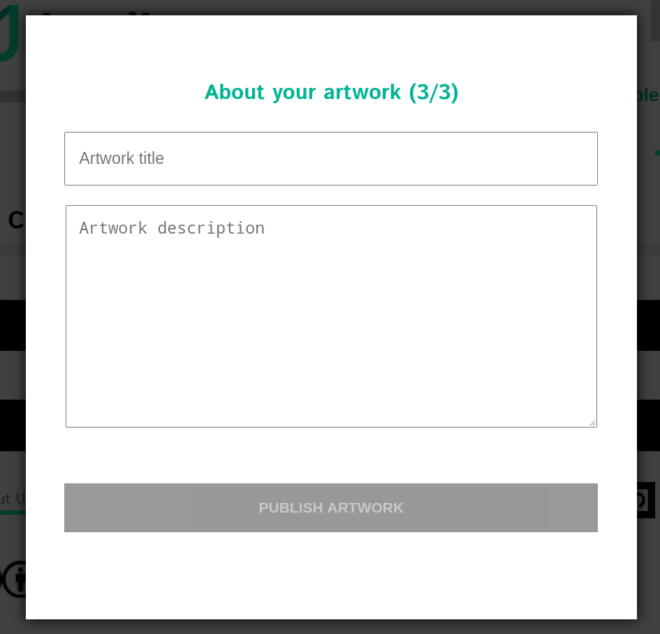

   Descrição sobre a Obra

Voilá! Você criou com sucesso sua primeira Obra Jandig e está quase terminando com este manual!

Exposições
~~~~~~~~~~~~

Bem-vindo ao último passo! Nesta fase final, mostraremos a você como expor sua arte para o mundo, utilizando o processo de criação de uma Exposição. É através das exposições que o público geral, o qual inclui usuários comuns e até artistas, terá acesso e poderá interagir com suas Obras.

Para começar, basta acessar o ícone "Create Exhibition" (Criar Exposição).

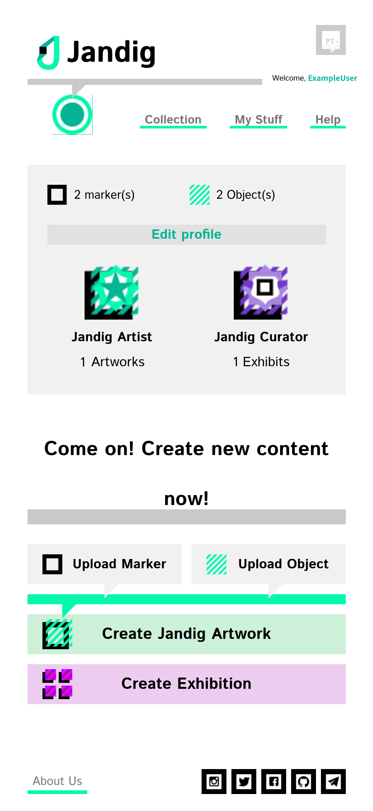

   Ícone da página de criação de Exposição

A seguir, você precisa confirmar que deseja selecionar Obras da coleção.

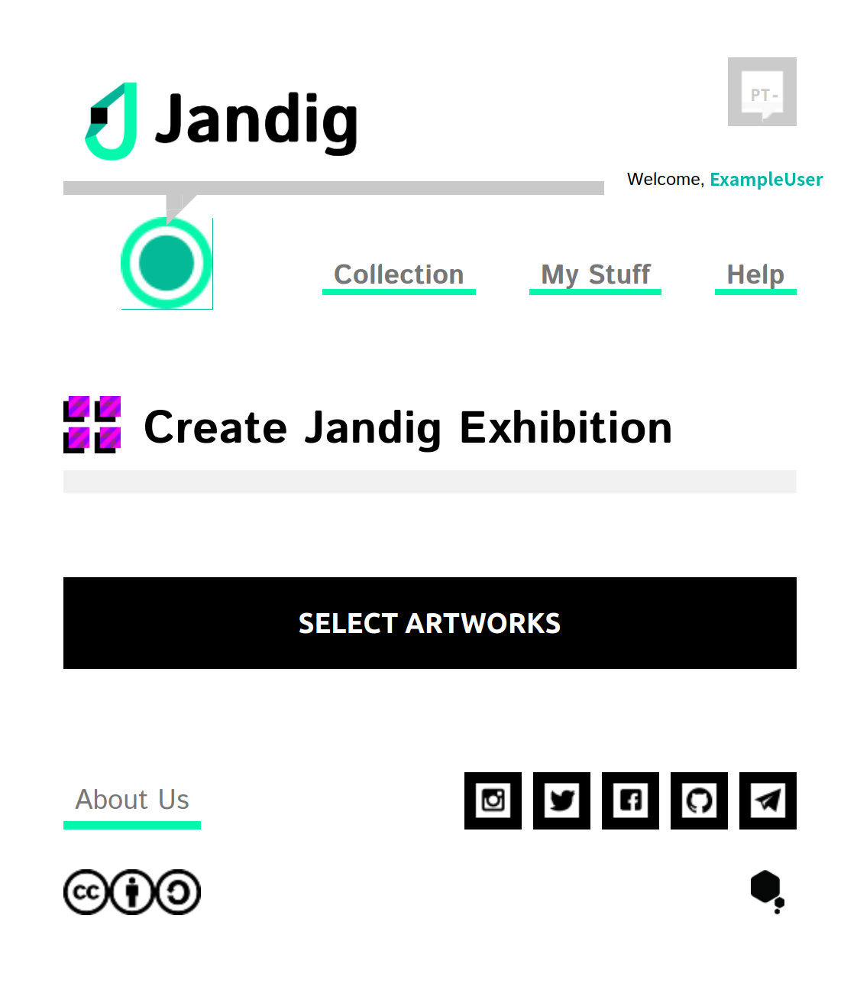

   Botão Select Artwork

Entre as Obras da coleção, procure e selecione uma ou mais que você deseja expor.

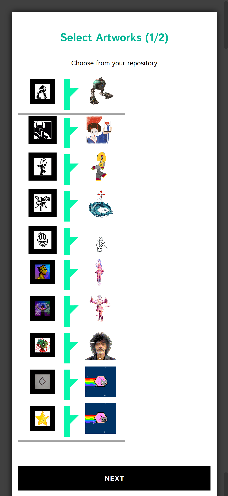

   Selecione Obras da sua coleção

Após selecionar uma ou mais Obras, dê um título à sua Exposição e defina sua URL. Esta URL será usada para acessar o conjunto de Obras selecionadas para sua exposição. Por exemplo, se você inserir "expos", a URL definitiva para acessar sua criação será "https://jandig.app/expos".

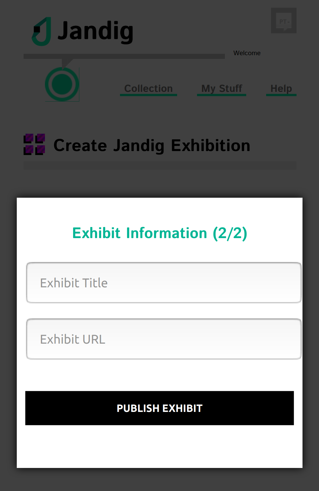

   Página de detalhes sobre sua Exposição

Acesse a URL final que você acabou de criar, aponte a câmera para o Marcador e veja a mágica acontecer!

Você pode ver todas as suas Exposições no menu "My stuff". E você também pode acessar diretamente de lá, clicando em "Veja esta Exposição".

... figura:: ../docs/images/exhibition-created.png
   escala: 30%

   Página criada da Exposição

E é isso! Se você chegou a este passo, você criou e exibiu com sucesso suas próprias Obras Jandig em AR para o mundo. Parabéns por ter chegado até aqui, e aproveite todas as experiências que o Jandig tem a oferecer!