**Como publicar conteúdo na Jandig**
====================================

Bem-vindo à Jandig Arte!

Neste tutorial, apresentaremos um guia detalhado para a criação de peças
artísticas utilizando tecnologia de Realidade Aumentada (AR, de
Augmented Reality). Explicaremos o funcionamento da plataforma Jandig de
maneira significativa, abordando conceitos centrais para que você
compreenda cada etapa do processo e sua influência na criação.
Abordaremos elementos fundamentais como Marcadores e Objetos, sua
interação na construção de uma Obra Jandig e de uma Exposição.

Vamos direto ao assunto, pois esta é uma leitura rápida e essencial para
quem deseja utilizar o Jandig para publicar AR.

**Tutorial de Iniciação Rápida**
--------------------------------

Acesse “\ `http://jandig.app” <http://jandig.app”>`__ e crie uma conta.

Acesse https://jandig.app/markers/upload, faça o upload da imagem (com
extensão .PNG), atribua um nome e declare o autor. Esta imagem será
reconhecida pela câmera da Jandig.

Acesse https://jandig.app/objects/upload e faça upload do GIF, vídeo
(nos formatos WEBM ou MP4) ou 3D (no formato GLB) com a sua animação. O
Jandig exibirá esse objeto sobre o marcador na câmera.

Clique em “Criar Obra Jandig”, escolha o Marcador e Objeto
correspondentes que você acabou de enviar. A Obra Jandig vincula o
Marcador ao Objeto para apresentação em realidade aumentada.

Clique em “Criar Exposição”. Escolha uma ou várias Obras. Dê um título
ao conjunto e defina sua URL. Com ela, você acessará o conjunto de Obras
que criar. Por exemplo, se você inserir “expoteste” a URL definitiva
para acessar sua(s) criações será
“\ `https://jandig.app/expoteste” <https://jandig.app/expoteste”>`__.

Acesse a URL definitiva que você acabou de criar, aponte a câmera para o
Marcador e veja a mágica acontecer!

**Tutorial - Aprenda o básico**
-------------------------------

Primeiramente, é necessário criar uma conta para distribuição das peças
pelos artistas. Não é obrigatório para quem deseja somente apreciar uma
Obra Jandig, mas torna-se essencial aos interessados em trabalhar com a
plataforma.

Para isso, consulte os passos abaixo.

1. Acesse o site do Jandig clicando no link apropriado e clique no botão
      “Sign up”.

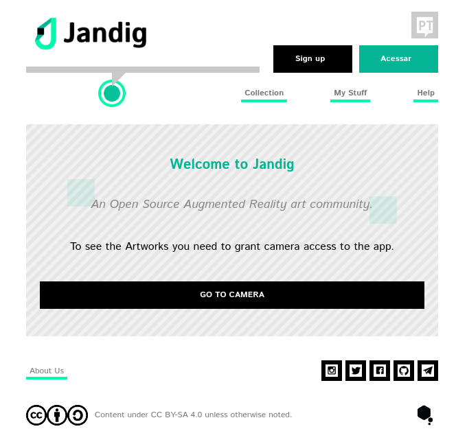

Página principal do Jandig

2. Preencha os espaços com as suas informações, conforme mostra a
      imagem, e submeta-a!

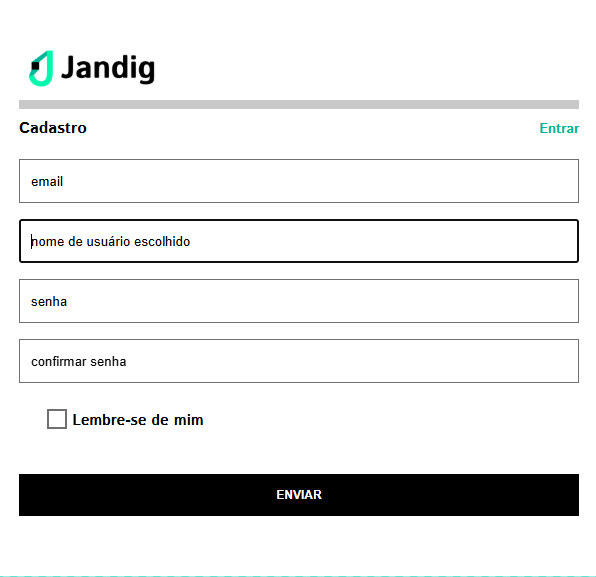

Página de cadastro

3. Parabéns! Você criou com sucesso a sua conta Jandig e agora pode
      publicar seu conteúdo em AR!

O próximo passo é produzir (e publicar) a sua primeira obra Jandig.
Antes de começar, você precisa compreender alguns conceitos
fundamentais.

Vamos analisá-los.

**Marcadores**
--------------

Os Marcadores fundamentam seu trabalho artístico. Consistem em uma
imagem, criada por você ou não, que o Jandig processa para ler e
apresentar a AR.

Caracteristicamente, eles possuem uma borda preta que é inserida ao
redor do desenho, que permite ao Jandig reconhecer os Marcadores.

Para criar um Marcador, basta ter uma imagem. Pode ser qualquer coisa,
uma pintura ou qualquer imagem da internet. O Jandig processará e gerará
o Marcador automaticamente.

Vá à página principal do aplicativo e na aba minhas criações selecione o
botão que diz “Enviar Marcador”. Você será recebido por esta tela.

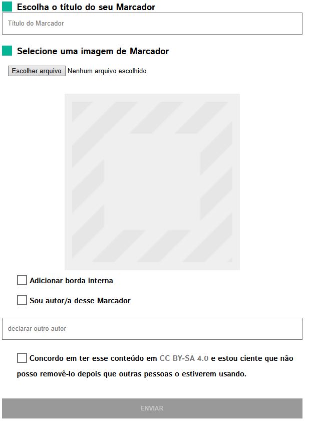

Página de upload de Marcador.

Neste campo, envie seu Marcador e preencha as informações como título e
nome do autor. Você poderá adicionar uma borda branca entre a imagem e a
borda preta - um elemento estético que não afeta a funcionalidade.
Selecione do seu dispositivo a imagem apropriada (arquivo .PNG).
Lembre-se de consultar todas as informações da página.

Voilá! Você criou com sucesso e adicionou um Marcador de AR à sua
coleção.

**Objetos**
-----------

Ao carregar um Marcador, o aplicativo redirecionará você para a página
principal. Na página, localize o botão que diz “Enviar Objeto”, que está
logo abaixo do botão “Enviar Marcador”. Vá em frente e clique nele, e o
aplicativo o levará a esta
`página <https://jandig.app/objects/upload>`__.

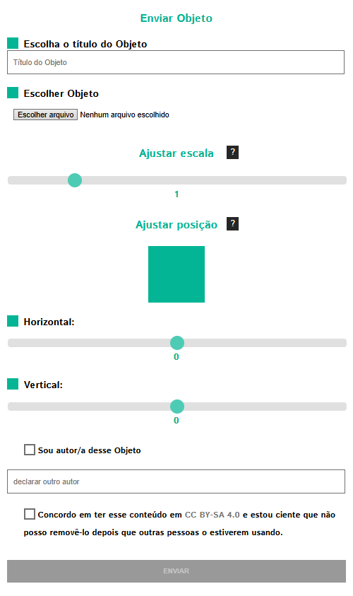

Página de Carregamento de Objetos

Nesta página, você enviará seu Objeto. No contexto do Jandig, o Objeto
será exibido na tela ao apontar a câmera do seu dispositivo. É a
verdadeira magia da AR e aquela para a qual todo o trabalho anterior
servirá. Portanto, vamos explorar a página e aprender como carregar um
Objeto.

Embora este formulário de envio seja maior, o processo simplifica-se.
Selecione e localize o arquivo que você deseja carregar. O Jandig aceita
os formatos .gif, .webm (inclusive com transparência), .mp4 e .glb.

O tamanho, tema, looping e outras especificações são flexíveis, mas
sugerimos conteúdo com loop perfeito alinhado à temática do Marcador.
Sinta-se à vontade para ir além de arquivos encontrados na internet ou
mídias sociais - explore suas habilidades artísticas para criar algo
original!

Agora é o momento de ter em mente que a escala e a posição do objeto
afetarão o trabalho artístico. Há dois campos onde você pode preencher
com números relacionados a esses dois parâmetros:

1. O parâmetro de escala tem valor padrão 1. Para aumentar a imagem em
      duas vezes, ajuste o valor para 2. Para triplicar as dimensões
      originais, use 3. A mesma lógica se aplica a outras proporções,
      incluindo reduções com números decimais - por exemplo, 0,5 reduz o
      objeto à metade do original.

2. O parâmetro de posição requer ajuste conforme o tamanho do objeto na
      tela, dividindo-se em parâmetros horizontal e vertical. Para
      melhor compreensão, considere um gráfico onde o valor padrão 0
      indica o centro, no ponto de interseção das linhas horizontais e
      verticais. Quanto aos ajustes: a) Horizontal: Com valor positivo
      2, o centro do objeto posiciona-se a uma distância equivalente ao
      dobro do tamanho do seu lado Marcador à direita. Com valor
      negativo -2, posiciona-se à mesma proporção à esquerda. b)
      Vertical: Com valor positivo 2, o centro do objeto posiciona-se a
      uma distância equivalente ao dobro do tamanho do seu lado Marcador
      acima. Com valor negativo -2, posiciona-se na mesma proporção
      abaixo.

Após carregar a imagem e definir os valores, lembre-se de incluir um
título e informar se você é o autor.

Voilà! Você criou com sucesso seu Objeto e agora pode criar sua Obra
Jandig! Lembre-se: o Marcador e Objeto, ainda não estão ligados um ao
outro. Isto acontecerá na próxima etapa.

**Obras Jandig**
----------------

Ok, então agora que já passamos por tudo o que precisávamos para criar
uma Obra Jandig, vamos ao processo de criá-la de fato. Uma Obra Jandig
combina dois elementos essenciais para gerar a interação desejada.

Você adivinhou bem, precisaremos utilizar o Marcador e Objeto criados
anteriormente. Nesta seção selecionaremos um Marcador e o Objeto para
criar a experiência AR, que será visualizada na câmera do seu
dispositivo. Retorne à página principal do Jandig mais uma vez e procure
por este botão:

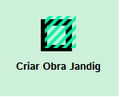

Botão Criar Obra Jandig

Clique nele para acessar uma página semelhante a esta:

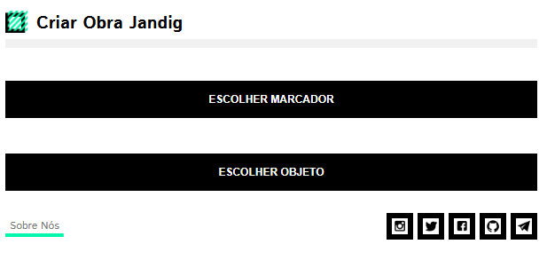

Página de seleção de Marcador e Objeto

Clique nele para acessar uma página semelhante a esta:

O processo é simples e direto, sendo o mesmo para ambos os itens. Um
pop-up exibirá muitos Marcadores e Objetos.

Basta escolher um Marcador, aceitar os termos e pressionar próximo para
indicar um Objeto. Aqui está um exemplo de Marcador e Objeto escolhidos:

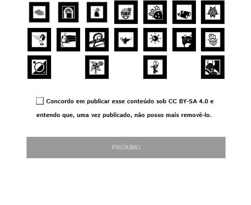

Página de seleção de Marcador

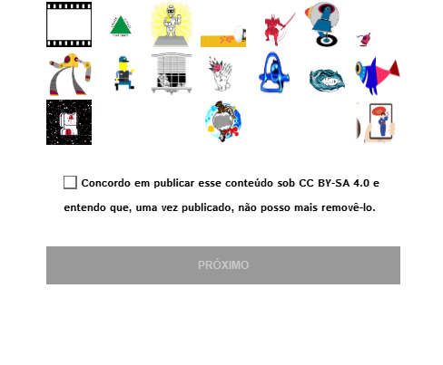

Página de seleção de objeto

Dê um título e uma descrição e pronto!

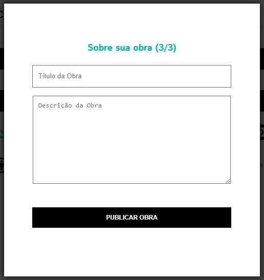

Descrição sobre a Obra

Voilá! Você criou com sucesso sua primeira Obra Jandig e está quase
terminando com este manual!

**Exposições**
--------------

Bem-vindo ao último passo! Nesta fase final, mostraremos a você como
expor sua arte para o mundo através do processo de criação de uma
Exposição. É por meio das exposições que o público geral, incluindo
usuários comuns e até artistas, terá acesso e poderá interagir com suas
Obras.

Para começar, basta acessar o ícone “Criar Exposição” .

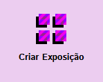

Ícone da página de criação de Exposição

A seguir, confirme que deseja selecionar Obras da coleção.

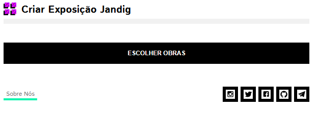

Botão Select Artwork

Entre as Obras da coleção, procure e selecione uma ou mais que você
deseja expôr.

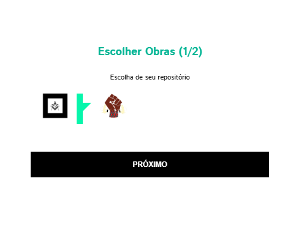

Selecione Obras da sua coleção

Após selecionar uma ou mais Obras, dê um título à sua Exposição e defina
sua URL. Esta URL permitirá acessar o conjunto de Obras selecionadas na
exposição. Por exemplo, se você inserir “expos”, a URL definitiva para
acessar sua criação será
“\ `https://jandig.app/expos” <https://jandig.app/expos”>`__.

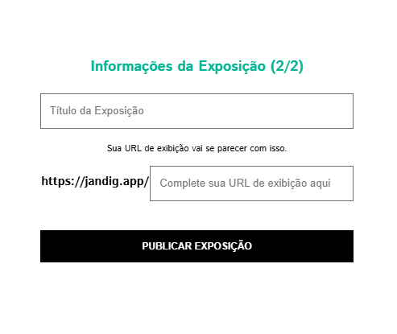

Página de detalhes sobre sua Exposição

Acesse a URL final que você acabou de criar, aponte a câmera para o
Marcador e veja a mágica acontecer!

Você pode ver todas as suas Exposições no menu “Minhas Criações”. E você
também pode acessar diretamente de lá, clicando em “Veja esta
Exposição”.

E é isso! Se você chegou até aqui, criou e exibiu com sucesso suas
próprias Obras Jandig em AR para o mundo. Parabéns por ter chegado até
aqui e aproveite todas as experiências que o Jandig oferece!
